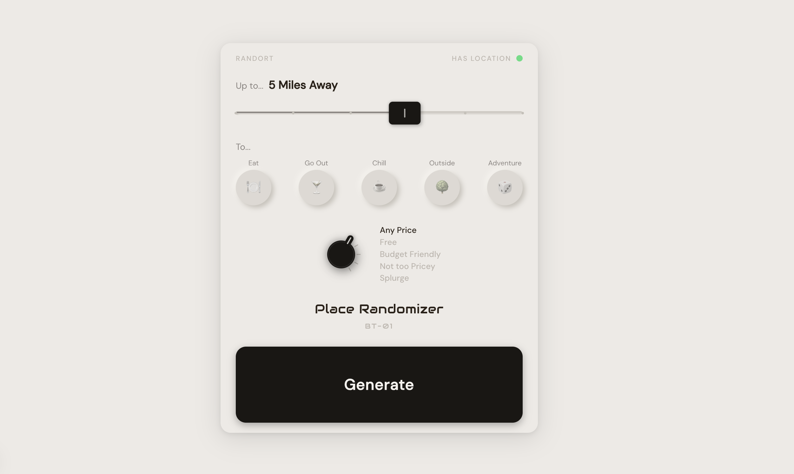

# Randо — BT-01

> Random place discovery. Set your filters, hit Roll, go somewhere you wouldn't have chosen yourself.



## What it does

Randort picks a real place near you to go when decision fatigue wins. You set a radius, a mood, and a price range. Tap Roll. It returns a single mystery card built from real Google Places reviews — name and exact address withheld. Tap "Let's Go" to open turn-by-turn directions in your native maps app; the place reveals itself only after you've committed to going.

It's a single-screen instrument modeled on Braun industrial design. No accounts, no database, no telemetry. Your location stays on your device; only filtered Google Places API requests cross the network, and they go directly to Google with your own API key.

## Requirements

- **Node.js 20.9+**
- **A Google Places API key** — see [Configuration](#configuration) below
- macOS, Linux, or Windows; any modern browser (mobile or desktop)

## Install

```bash
git clone https://github.com/Benjamin00/Randort.git
cd Randort
npm ci
npm run dev
```

On first run, you'll be prompted to paste a Google Places API key. It's saved to `.env.local` (gitignored). Subsequent runs skip the prompt.

Then open <http://localhost:3000>.

If you'd rather configure the key non-interactively (CI, scripted setup, etc.), copy `.env.example` to `.env.local` and fill it in before running `npm run dev`.

## Configuration

| Variable | Required | Where to get it |
| --- | --- | --- |
| `GOOGLE_PLACES_API_KEY` | yes | [Google Cloud Console](https://console.cloud.google.com/google/maps-apis/credentials) — enable **Places API (New)** + **Geocoding API**, create an API key, restrict it to those services |

The key is read server-side by the Next.js API route at `/api/places`. It never reaches the browser. Your `.env.local` is gitignored; treat it like a password.

## Run

```bash
npm run dev          # development server, hot reload, http://localhost:3000
npm run setup        # re-run the API key prompt (overwrite or set the key)
npm run build        # production build
npm run start        # production server (after build)
npm run lint         # eslint
```

## Deploy your own

Randort is a standard Next.js app. The cleanest free path is Vercel:

1. Fork this repo on GitHub.
2. Import the fork into [Vercel](https://vercel.com/new).
3. Add `GOOGLE_PLACES_API_KEY` to the project's Environment Variables.
4. Deploy.

Your key stays in your Vercel account. No third party (including this repo) ever sees it.

## Cost

Randort fires one Google Places API call when you tap Roll, and one Place Details call per re-roll. Typical session (1 roll + 2 re-rolls) ≈ $0.08. Google's $200/month free credit covers about 2,500 sessions. See [`SPEC.md`](./SPEC.md#cost-model) for the full breakdown.

## Project docs

- [`SPEC.md`](./SPEC.md) — full product spec: design system, API contracts, mystery card construction.
- [`CLAUDE.md`](./CLAUDE.md) — code conventions for AI-assisted development.

## License

MIT — see [`LICENSE`](./LICENSE).

---

Part of the [Pedalboard](https://github.com/Benjamin00/pedalboard) catalog of small self-hostable tools. One job per applet, your keys on your machine, versions pinned.
